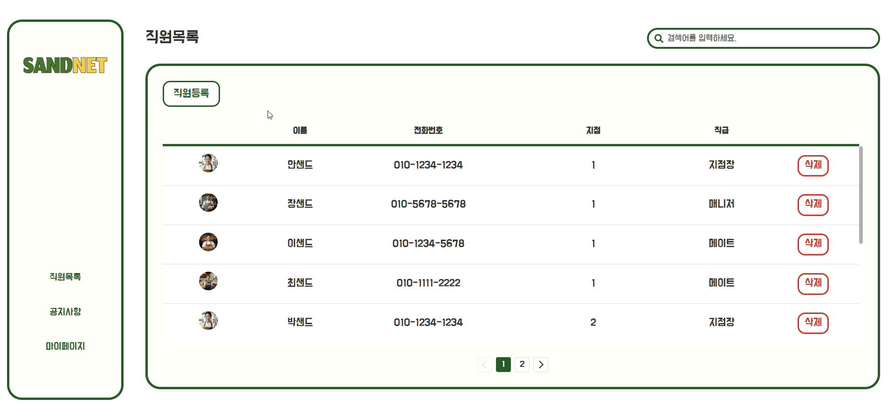
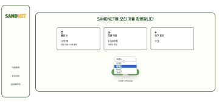
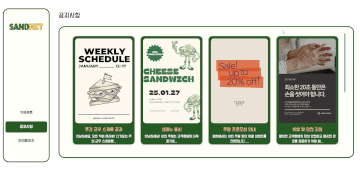

<h1 align="center">🔎 About SANDNET 🔍</h1>

<div align="center">

기존 알바생 근태 관리 방식에서는

**효율성 부족**, **정확성 문제**, **과도한 시간과 노력 낭비** 등의 문제가 존재했습니다

이러한 문제를 해결하기 위해 저희는 샌드위시라는 가상의 프랜차이즈 매장에서 사용할 수 있는

**SANDNET 인트라넷 서비스**를 구축했습니다.

**SANDNET**은 프랜차이즈 인트라넷 서비스로 <br />

근태 정보를 쉽고 효율적으로 관리할 수 있도록 설계된 온라인 근태 관리 시스템입니다.

사용자는 직관적인 인터페이스를 통해 빠르게 근태 정보를 확인하고,

시간 절약과 생산성 향상을 기대할 수 있습니다.

</div>

<br />

## 🚀 Features

1.  **마이페이지**

    - 프로필 확인
    - 현재 시간 확인 & 출퇴근 시간 기록
    - 유형별 근태 신청
    - 근태 목록 확인, 필터링 

2.  **프로필**

    - 유저 정보 보여주기
    - 유저 프로필 이미지 CRUD (firebase 활용) 

3.  **직원 목록**

    - 직원 목록 확인
    - 직원 검색

      

4.  **공지사항** - 공지 미리보기 - 모달을 활용한 공지 상세보기\*\*

          

    <br />

<div >
  <h2 align="center"> Tech Stacks</h2>

  <h3>Frontend</h3>
  <div align="center">
    
    
    
    
  </div>

  <h3>Backend</h3>
  <div align="center">
    
  </div>

  <h3>Database</h3>
  <div align="center">
    
  </div>

  <h3>Cloud & Deployment</h3>
  <div align="center">
    
  </div>
</div>

<br />

<div>
  <h2 align="center"> Tools</h2>
  <br />
  <div align="center">
        
        
        
        
        
  </div>
  <br />
</div>

---

<br />
<div align="center">
 <h1>팀소개</h1>
  <table>
    <tr>
      <td align="center">
        <a href="https://github.com/YosepAhn">
          
        </a>
        <br />
        <strong>안요셉</strong>
        <br />
        <p>ISTP</p>
        <p>직원목록 페이지</p>
      </td>
      <td align="center">
        <a href="https://github.com/jiwonnayoung">
          
        </a>
        <br />
        <strong>이지원</strong>
        <br />
        <p>ISTP</p>
        <p>공지사항 페이지</p>
      </td>
      <td align="center">
        <a href="https://github.com/Jang-eunhye">
          
        </a>
        <br />
        <strong>장은혜</strong>
        <br />
        <p>ISTP</p>
        <p>마이 페이지</p>
      </td>
      <td align="center">
        <a href="https://github.com/chjjh0">
          
        </a>
        <br />
        <strong>최정훈</strong>
        <br />
        <p>ISTP</p>
        <p>프로필 페이지</p>
      </td>
    </tr>
  </table>
</div>

<br />

---

<br />

## 🤝 Collaboration

### **Git 워크플로우**

1. **Main Branch**: 안정된 배포 버전.
2. **Dev Branch**: 기능 개발 브랜치.
3. **Feature Branches**: 각 기능별 작업.

<br />

## 🌟 Future Enhancements

- **맛집 추천 알고리즘**: 사용자의 찜과 리뷰 데이터를 분석하여 추천 맛집 제공.
- **예약 기능 추가**: 맛집 예약 기능 연동.
- **커뮤니티 기능**: 사용자 간 소통 및 리뷰 공유.

## 📚 Installation

1. 저장소 클론:

   ```bash
   git clone https://github.com/Dev-FE-3/team1-woowahaniz-jjinmat.git
   cd team1-woowahaniz-jjinmat
   ```

2. 의존성 설치:

   ```bash
   npm install
   ```

3. 환경 변수 설정:

   - 프로젝트 루트에 있는 `.env.example` 파일을 복사하여 `.env` 파일로 이름을 변경합니다.
   - `.env` 파일에서 프로젝트에 필요한 환경 변수를 설정합니다.

   Example:

   ```bash
   REACT_APP_API_URL=https://your-api-endpoint.com
   REACT_APP_GOOGLE_MAPS_API_KEY=your-google-maps-key
   ```

---

<br />

## 🧑‍💻 Run Locally

### 개발 환경 실행:

```bash
npm run dev
```

### 운영 환경 빌드:

```bash
npm run build:production
```

---

<br />

## 📖 Document

프로젝트 설계 문서는 design 디렉토리에 마크다운 파일로 기록되어있습니다. 각각의 설계 문서는 다음과 같습니다.

- 요구사항 정의서
  - 제품이 제공해야되는 기능 요구 정의서입니다.
  - 요구사항 정의서에 기술된 기능은 최소 기능 요구사항이며 추상적일 수 있으며 기능의 구체화는 제품 구현 단계에서 이루어집니다.
- 프로젝트 설계서
  - 요구사항 정의서를 기반으로 프로젝트를 설계합니다.
- 기능 정의서
  - 사용자 스토리 기반으로 세부 기능을 정의합니다.

---

<br />

---

# Toy Project 1 template

이 프로젝트는 토이 프로젝트 1 을 위한 템플릿 프로젝트입니다. 템플릿에는 vite 기반 프론트앤드 프로젝트 구조와 express 기반 node 서버를 포함하고 있습니다.

## 설치

```
npm install
```

## 실행

### 서버 실행

```
npm run server
```

### 클라이언트 실행

```
npm run dev
```

## 🤝 Collaboration

### **Git 워크플로우**

1. **Main Branch**: 안정된 배포 버전.
2. **Dev Branch**: 기능 개발 브랜치.
3. **Feature Branches**: 각 기능별 작업.

<br />

## 🌟 Future Enhancements

- **맛집 추천 알고리즘**: 사용자의 찜과 리뷰 데이터를 분석하여 추천 맛집 제공.
- **예약 기능 추가**: 맛집 예약 기능 연동.
- **커뮤니티 기능**: 사용자 간 소통 및 리뷰 공유.

## 📚 Installation

1. 저장소 클론:

   ```bash
   git clone https://github.com/Dev-FE-3/team1-woowahaniz-jjinmat.git
   cd team1-woowahaniz-jjinmat
   ```

2. 의존성 설치:

   ```bash
   npm install
   ```

3. 환경 변수 설정:

   - 프로젝트 루트에 있는 `.env.example` 파일을 복사하여 `.env` 파일로 이름을 변경합니다.
   - `.env` 파일에서 프로젝트에 필요한 환경 변수를 설정합니다.

   Example:

   ```bash
   REACT_APP_API_URL=https://your-api-endpoint.com
   REACT_APP_GOOGLE_MAPS_API_KEY=your-google-maps-key
   ```

---

<br />
## 설치

```
npm install
```

## 실행

### 서버 실행

```
npm run server
```

### 클라이언트 실행

```
npm run dev
```

## 🧑‍💻 Run Locally

### 개발 환경 실행:

```bash
npm run dev
```

### 운영 환경 빌드:

```bash
npm run build:production
```

---

<br />

## 📖 Document

프로젝트 설계 문서는 design 디렉토리에 마크다운 파일로 기록되어있습니다. 각각의 설계 문서는 다음과 같습니다.

- 요구사항 정의서
  - 제품이 제공해야되는 기능 요구 정의서입니다.
  - 요구사항 정의서에 기술된 기능은 최소 기능 요구사항이며 추상적일 수 있으며 기능의 구체화는 제품 구현 단계에서 이루어집니다.
- 프로젝트 설계서
  - 요구사항 정의서를 기반으로 프로젝트를 설계합니다.
- 기능 정의서
  - 사용자 스토리 기반으로 세부 기능을 정의합니다.

---

<br />

---
